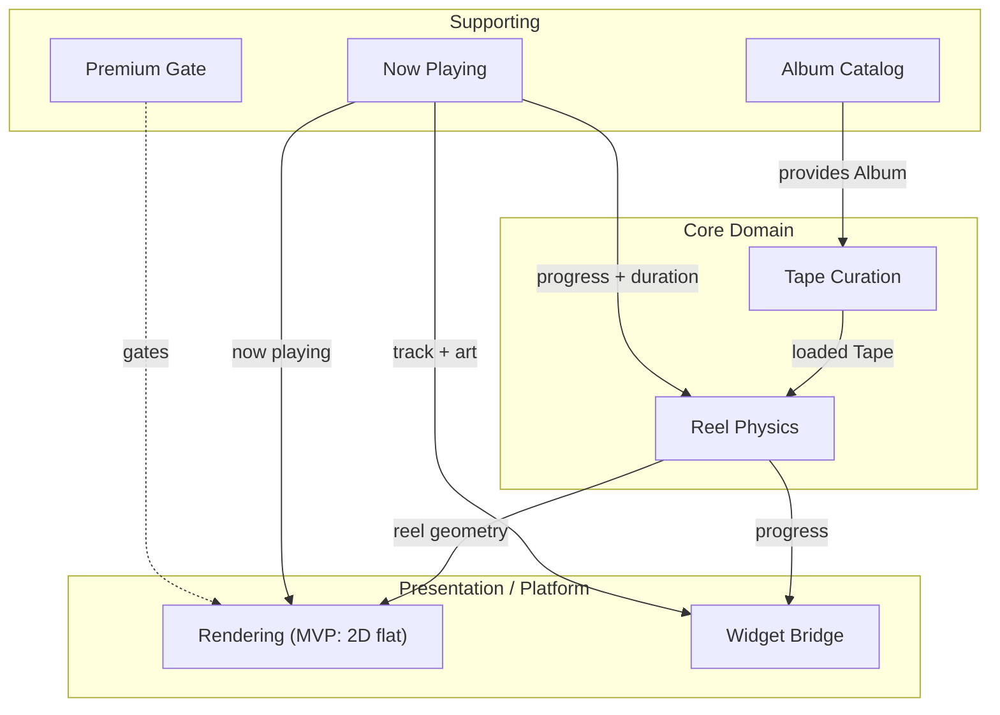

# Tapepod — Domain Context

> The single source of domain truth for Tapepod. Ubiquitous language, bounded
> contexts, and the core aggregates. Built on [PRD-001](docs/PRD-001-tapepod-mvp.md);
> reuses its module names as canonical vocabulary.

Tapepod is a cassette-tape music player and home-screen widget for iOS. It turns
"what am I listening to" into a tactile, deliberate object: you **load one album
into the deck**, and a pair of cassette reels physically wind down as the music
plays — the supply reel shrinks, the take-up reel grows.

---

## Visual direction — MVP vs. vision

Two visual directions exist for the **Deck**, and both are kept:

- **MVP** — flat 2D line-art cassette mechanism: monochrome with a yellow accent,
  Teenage Engineering registration marks (the reference image). This is what ships.
- **Vision** — the PRD's 3D transparent Walkman with gyroscope tilt. Deferred,
  revisited as a premium layer later.

Decided in **[ADR-0001](docs/adr/0001-visual-direction.md)**. The choice is isolated
to the **Rendering** context — Reel Physics is pure math and feeds either renderer
unchanged, so the rest of this document holds for both.

---

## Ubiquitous Language

Terms used exactly as defined here, in code, issues, and conversation. Drawn from
the PRD so there is one vocabulary, not two.

| Term | Meaning |
|------|---------|
| **Tape** | The single album currently loaded into the deck. Max 20 tracks. The product's central object. |
| **Deck** | The player itself — the thing a Tape is loaded *into*. |
| **Load** | The deliberate act of committing one album to the Deck. Replaces whatever was loaded before. |
| **Supply reel** | The reel that *shrinks* as a song plays. Holds the "unplayed" tape. |
| **Take-up reel** | The reel that *grows* as a song plays. Holds the "played" tape. |
| **Reel geometry** | The computed radii + rotation of both reels for a given playback position. Pure math. |
| **Now Playing** | The unified, service-agnostic snapshot of playback: track, album, progress (0–1), duration, playing/paused. |
| **Service** | A connected music source — Spotify or Apple Music. Hidden behind Now Playing. |
| **Premium** | The one-time $4.99 unlock for the full interactive player. |
| **Widget** | The home-screen face. Static / lightly animated. The "shop window." |
| **No-tape state** | The tactful empty state shown before any album is loaded. |

---

## Context Map

---

## Bounded Contexts

### 1. Tape Curation — *core*
Owns the single loaded **Tape**. Enforces the one-album, ≤20-track rule. Validates
a selection before Loading it, persists it across app restarts, and replaces the
previous Tape on a new Load. This context *is* the difference between Tapepod and a
passive mirror widget — it owns the intentionality.
> PRD module: **Tape Curator**

### 2. Reel Physics — *core*
Pure computation. Given a playback position (0–1) and total album duration, produces
**Reel geometry** — the radii and rotation of supply and take-up reels. No UI, no
side effects. Owns the *feel*: easing, the sense of mass, the way a fuller reel winds
slower. **The PRD names getting this feel right as the #1 risk.**
> PRD module: **Tape Reel Animator**

### 3. Now Playing — *supporting*
Normalizes Spotify and Apple Music into one **Now Playing** snapshot and one state
machine (playing / paused / stopped). The single source of truth for playback state.
Hides all Service-specific differences.
> PRD module: **Now Playing Engine**

### 4. Album Catalog — *supporting*
Search and fetch from the connected Service; returns a normalized **Album** (title,
artist, ≤20 tracks, total duration, artwork). The 20-track cap is applied here on
ingest. Feeds Tape Curation.
> PRD module: **Album Loader**

### 5. Premium Gate — *supporting*
Wraps StoreKit. Owns the one-time purchase state, gates the full player, and restores
purchases on reinstall. Free tier = Widget only.
> PRD module: **Premium Gate**

### 6. Rendering — *presentation*
Consumes Reel geometry + Now Playing and draws the **Deck**.
- **MVP:** flat 2D line-art (Skia/SVG), monochrome + yellow, TE registration marks.
  Doubles as the Widget face.
- **Vision:** 3D transparent Walkman + gyroscope tilt. Deferred. See ADR-0001.
> PRD modules: **3D Walkman Renderer** (vision) + **Motion Engine** (vision only —
> gyroscope tilt is post-MVP).

### 7. Widget Bridge — *platform*
A thin layer: serializes track title, artwork, and reel progress into App Group
shared storage for the native WidgetKit extension to read. No business logic.
> PRD modules: **Widget Bridge** + **WidgetKit Extension**.

---

## Aggregates

The domain is small — single user, offline-capable, mostly visual. Two aggregates
carry it.

### Tape *(root: the loaded album)*
- **Invariants:** exactly one Tape loaded at a time; ≤20 tracks; must reference a
  valid Album before it can be Loaded.
- **Identity:** the album it wraps.
- **Persistence:** survives app restart (last-loaded is remembered).
- **Owned by:** Tape Curation.

### Playback Session *(root: the current Now Playing state)*
- **Invariants:** progress ∈ [0,1]; one of playing / paused / stopped at any time;
  references the loaded Tape.
- **Derives:** Reel geometry (via Reel Physics) — not stored, recomputed from
  progress + duration.
- **Owned by:** Now Playing.

---

## Domain Events

| Event | Raised by | Consumers |
|-------|-----------|-----------|
| `AlbumSelected` | Album Catalog | Tape Curation (validate → Load) |
| `TapeLoaded` | Tape Curation | Rendering, Widget Bridge, Now Playing |
| `PlaybackProgressed` | Now Playing | Reel Physics, Widget Bridge |
| `PlaybackPaused` / `PlaybackResumed` | Now Playing | Rendering (freeze/resume reels), Widget Bridge |
| `PremiumUnlocked` | Premium Gate | Rendering (reveal full Deck) |

---

## User Stories by Context

Mapped from the PRD's 27 stories so each context owns its slice.

**Tape Curation**
- Load one album to make listening a deliberate choice. *(PRD 7)*
- Enforce the 20-track maximum. *(PRD 8)*
- Remember the last-loaded album across sessions. *(PRD 17)*
- Show a tactful "no tape loaded" state on first install. *(PRD 25)*

**Reel Physics**
- Reels spin in real time as music plays. *(PRD 2)*
- Supply reel shrinks / take-up reel grows with song progress. *(PRD 3)*
- Reel sizes reflect total album duration. *(PRD 4)*
- Reels pause when music pauses. *(PRD 18)*

**Now Playing**
- Connect Spotify. *(PRD 9)* · Connect Apple Music. *(PRD 10)*
- Widget updates in real time as the song progresses. *(PRD 12)*
- Works offline once an album is loaded. *(PRD 20)*

**Album Catalog**
- Search and select an album from inside the app. *(PRD 23)*
- Search pulls from the connected Service. *(PRD 24)*

**Premium Gate**
- Free tier shows the Widget. *(PRD 13)*
- One-time $4.99 unlock for the full player. *(PRD 14, 15)*
- Preview the player before buying. *(PRD 26)*
- Purchase restores on reinstall. *(PRD 27)*

**Rendering**
- *MVP:* a flat 2D Deck that reads as a crafted object. *(PRD 5, 6)*
- *MVP:* album art appears as the tape label. *(PRD 19)*
- *Vision:* responds to device tilt, weighty not jumpy. *(PRD 21, 22 — post-MVP)*

**Widget Bridge**
- Widget shows the loaded album's artwork. *(PRD 11)*
- Widget available in small / medium / large sizes. *(PRD 16)*

---

## What this domain is *not*

No audio processing or EQ. No custom track ordering. No playlists (v1.1). No
SoundCloud, no Android (post-MVP). The Deck plays one Tape, beautifully — nothing more.
