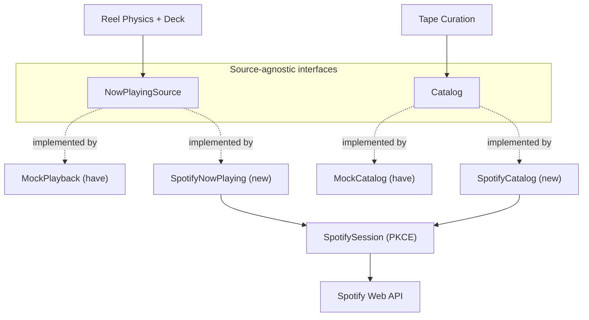

# Spotify Integration — System Design

> Goal: get **real Spotify data driving the reels**, testable in the smallest
> honest loop. Decision rationale lives in [ADR-0002](../adr/0002-spotify-integration.md);
> this is the how.

## What "testable" means here

The smallest real-data loop: **log in with Spotify → play any song in Spotify →
Tapepod's reels wind to the real track progress.** That's "mirror mode." It proves
the Now Playing → Reel Physics pipeline on real data, works on Spotify **Free**, and
needs no playback control and no backend. Everything else builds out from there.

---

## ⛔ Prerequisites — Till must do these (I can't)

Testing is blocked until these exist. They take ~15 min in the Spotify dashboard.

- [ ] **Register a Spotify app** at <https://developer.spotify.com/dashboard> →
      get a **Client ID** (public; no secret needed with PKCE).
- [ ] **Add redirect URIs** to the app:
      - `http://127.0.0.1:8081` — web testing (**not** `localhost`, it's rejected)
      - `tapepod://callback` — native (iOS) testing
- [ ] **Allowlist your Spotify account** under the app's *Users* (dev mode allows
      ~25 accounts; add any testers' Spotify emails too).
- [ ] **Tell me: do you have Spotify Premium?** It changes what's testable:
      - **Free** → mirror mode (Phases 1–2) works fully.
      - **Premium** → also unlocks playback control (Phase 3).
- [ ] Put the Client ID in `.env` as `EXPO_PUBLIC_SPOTIFY_CLIENT_ID` (gitignored).

> ⚠️ When testing on web, open **`http://127.0.0.1:8081`**, not `localhost:8081` —
> the redirect URI must match exactly.

---

## Architecture — ports & adapters

The mock pieces we already built become the **offline contract** the Spotify
adapters must satisfy. Nothing above the port changes when we swap source.



### The two ports

```ts
// src/now-playing/types.ts
export interface NowPlayingSnapshot {
  track: { title: string; artist: string; durationMs: number } | null;
  positionMs: number;   // position within the current track
  isPlaying: boolean;
  fetchedAt: number;    // ms timestamp — anchor for local interpolation
}

export interface NowPlayingSource {
  /** One reading of current state. Spotify: GET /me/player. Mock: computed. */
  poll(): Promise<NowPlayingSnapshot>;
}
```

```ts
// src/catalog/types.ts
export interface Album {
  id: string;
  title: string;
  artist: string;
  artworkUrl?: string;
  tracks: { id: string; title: string; artist: string; durationMs: number }[];
}

export interface Catalog {
  search(query: string): Promise<Album[]>;
  getAlbum(id: string): Promise<Album>;
}
```

Both ports get a **MockX** (offline, what we have) and a **SpotifyX** (real)
implementation. A config flag picks which is live, so mock dev never breaks.

> Note: normalise on **milliseconds** internally (Spotify's unit). Our current mock
> `Track.durationSec` becomes `durationMs` in the port.

---

## The feel-critical detail: interpolate locally, resync to polled truth

`GET /me/player` can only be polled every ~1–3s. **Feeding those values straight to
the reels makes them lurch** — which directly violates the PRD's "weighty, not
jumpy" (the #1 risk).

So `SpotifyNowPlaying` does **not** replace our smooth rAF loop. It keeps the local
per-frame advance and *corrects* it against the poll:

1. rAF advances `positionMs` locally every frame (`+dt` while `isPlaying`) — smooth.
2. Every ~2s, poll Spotify for the true `progress_ms` / `is_playing`.
3. If the local estimate has **drifted** past a threshold (or play/pause/track
   changed), **ease** the reels toward truth rather than snapping.

This is exactly the resync our existing `useMockPlayback` rAF loop is already shaped
for — we're adding a correction source, not rebuilding it.

---

## Auth — OAuth 2.0 PKCE via expo-auth-session

`expo-auth-session` handles PKCE on web **and** native; `makeRedirectUri` picks the
right redirect per platform (loopback IP on web, `tapepod://callback` on native).

- **Scopes:** mirror needs `user-read-playback-state user-read-currently-playing`.
  Control (Phase 3) adds `user-modify-playback-state`. Search uses the user token,
  no extra scope.
- **Tokens:** access (~1h) + refresh. Store via the persistence layer we already use
  (AsyncStorage); refresh before expiry. PKCE = **no client secret in the app**.
- **No backend** for testing. Production hardening option: a token broker (Supabase
  edge function is available) so refresh tokens don't live in web storage.

---

## Phasing (each phase ends in a real test)

| Phase | Build | Test (the checkable outcome) | Needs |
|-------|-------|------------------------------|-------|
| **0** | Prereqs above | App registered, Client ID in `.env` | Till |
| **1** | PKCE auth + `SpotifyNowPlaying` (mirror) | Log in, play a song in Spotify, **reels wind to real progress**; pause in Spotify, reels freeze | Free |
| **2** | `SpotifyCatalog` (search + getAlbum) | Search a real album in-app, add its tracks to a tape, persists | Free |
| **3** | Playback control (`PUT /me/player/play`) | Tap play in Tapepod → Spotify starts the **loaded tape** | **Premium** |

Phase 1 is the milestone that answers "can we test it" — yes, after prereqs.

---

## Footguns (verified / known)

- **`localhost` redirect is rejected** (since 2025-04-09). Use `http://127.0.0.1:8081`.
- **Implicit grant is dead** — Authorization Code + PKCE only.
- **Premium** required for control + Web Playback SDK; **not** for mirror.
- **`/me/player` returns `204 No Content`** when no device is active — handle as
  "nothing playing," show the no-tape/idle state, don't crash.
- **Rate limits** — poll ~2s; back off on HTTP 429 (respect `Retry-After`).
- **Dev mode** caps at ~25 allowlisted users; each tester's Spotify email must be added.
- **Web Playback SDK won't help on iOS** — for iOS playback control, target an active
  device via the Web API, or later adopt the native App Remote SDK (heavier). Mirror
  + web-control first.
- **Progress semantics:** `/me/player` = position in the *current track*. The PRD's
  reels model the *whole album* (story 4). Mirror tests track-level; album-level
  cumulative progress is deferred — don't claim story 4 from mirror mode.

---

## Testing strategy

- **Contract:** mock and Spotify adapters satisfy the *same* port. A thin contract
  test asserts both return the agreed shape (null track, paused, playing).
- **Source toggle:** `EXPO_PUBLIC_SOURCE=mock|spotify` (or a dev-menu switch) so
  offline/mock dev continues and we can A/B the real adapter against the mock feel.
- **Pure logic stays unit-tested** (`tape.assert.ts`, `reelPhysics.assert.ts`).
  Adapters are verified by the contract test + manual per-phase test above.
- **Keep mock as fallback** when not authed or offline (PRD: works offline once a
  tape is loaded).

---

## Open decisions (for Till)

1. **Client-only PKCE vs token broker.** Recommend client-only for testing; revisit
   a Supabase broker before public release. *(My pick: client-only now.)*
2. **iOS playback control:** Web API → active device (simpler) vs native App Remote
   SDK (richer, heavier). *(My pick: Web API first; defer native SDK.)*
3. **Mirror vs control as the product's real model.** Mirror is fastest to test, but
   the PRD's vision is *load a deliberate tape and play it* (control). Mirror is a
   testing/validation step, not necessarily the shipped interaction. *(Confirm.)*
